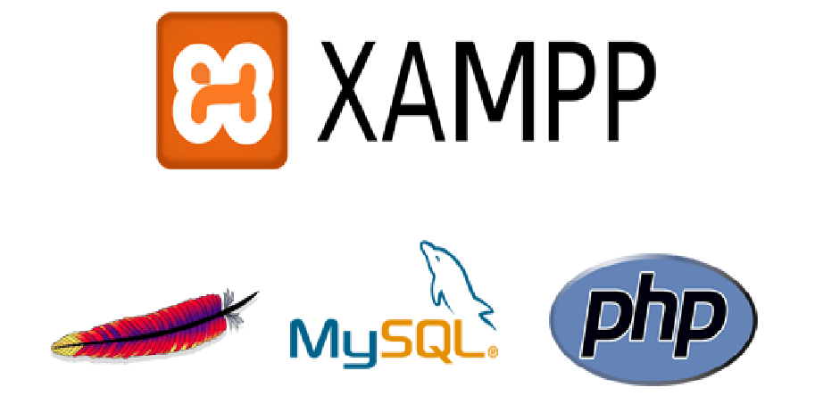
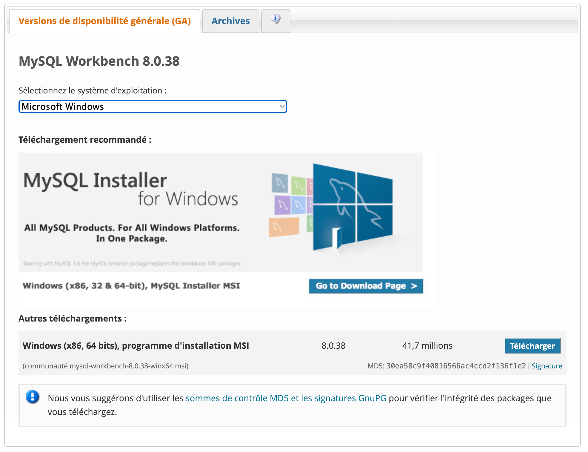

### **Utilisation d'un serveur local tel que XAMPP ou WAMP** :


- **XAMPP** : XAMPP est une distribution Apache qui inclut PHP, MySQL, et d'autres outils essentiels. Il est facile à installer et à configurer. Téléchargez simplement le package XAMPP depuis le site officiel, exécutez l'installateur, et suivez les instructions. Une fois installé, vous pouvez démarrer le serveur Apache et MySQL depuis le panneau de contrôle XAMPP.
- **WAMP** : WAMP (Windows, Apache, MySQL, PHP) est une autre option populaire pour les utilisateurs de Windows. L'installation est similaire à XAMPP. Téléchargez WAMP depuis le site officiel, installez-le, et démarrez les services Apache et MySQL via le tableau de bord WAMP.

### **Installation manuelle de PHP** :

- Vous pouvez également installer PHP manuellement en téléchargeant les binaires PHP depuis le site officiel de PHP. Après le téléchargement, extrayez les fichiers et configurez votre serveur web (comme Apache ou IIS) pour utiliser PHP en modifiant les fichiers de configuration (comme httpd.conf pour Apache).

### Installation et configuration de MySQL

[](https://dev.mysql.com/downloads/workbench/)

MySQL est un système de gestion de bases de données relationnelles open source, largement utilisé avec PHP pour développer des applications web dynamiques.

##### Télécharger et installer MySQL

1. **Téléchargement de MySQL** :
   - Rendez-vous sur le site officiel de MySQL et [téléchargez](https://dev.mysql.com/downloads/workbench/) la version appropriée pour votre système d'exploitation (Windows, macOS, ou Linux).
2. **Installation sur Windows** :
   - Exécutez l'installateur téléchargé et suivez les instructions à l'écran. Vous pouvez opter pour une installation personnalisée ou utiliser les paramètres par défaut. Pendant l'installation, vous serez invité à configurer le mot de passe root et d'autres options de sécurité.

##### Configuration de MySQL

1. **Démarrer le serveur MySQL** :
   - Après l'installation, démarrez le serveur MySQL en exécutant le service correspondant. Sur Windows, vous pouvez le faire via le Panneau de configuration ou en utilisant la ligne de commande.
   - Pour démarrer le serveur MySQL à partir de la ligne de commande, utilisez la commande suivante :
     ```bash
     net start mysql
     ```
2. **Connexion à MySQL** :
3. **Configuration des utilisateurs et des privilèges** :
   - Une fois connecté, vous pouvez configurer les utilisateurs, les bases de données, et les privilèges d'accès en utilisant des commandes SQL ou des outils graphiques comme MySQL Workbench.
   - Pour créer un nouvel utilisateur, vous pouvez utiliser la commande suivante :
     ```sql
     CREATE USER 'username'@'localhost' IDENTIFIED BY 'password';
     ```
     
        Remplacez `'username'` par le nom d'utilisateur souhaité et `'password'` par le mot de passe correspondant.
   - Pour accorder des privilèges à l'utilisateur sur une base de données spécifique, utilisez la commande suivante :
     ```sql
     GRANT ALL PRIVILEGES ON database_name.* TO 'username'@'localhost';
     ```
     
   Remplacez `'database_name'` par le nom de la base de données spécifique et `'username'` par le nom d'utilisateur auquel vous souhaitez accorder les privilèges.
   
   - Après avoir configuré les utilisateurs et les privilèges, vous pouvez commencer à utiliser MySQL pour stocker et gérer les données de votre application web.
   - Pour plus d'informations sur la configuration et l'utilisation de MySQL, consultez la [documentation officielle de MySQL](https://dev.mysql.com/doc/).