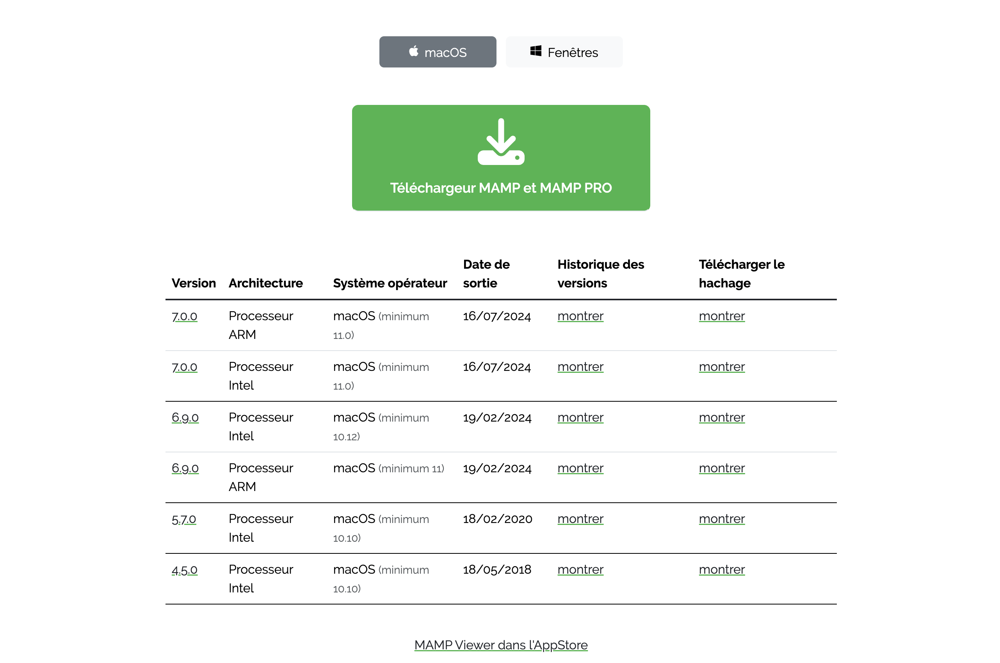
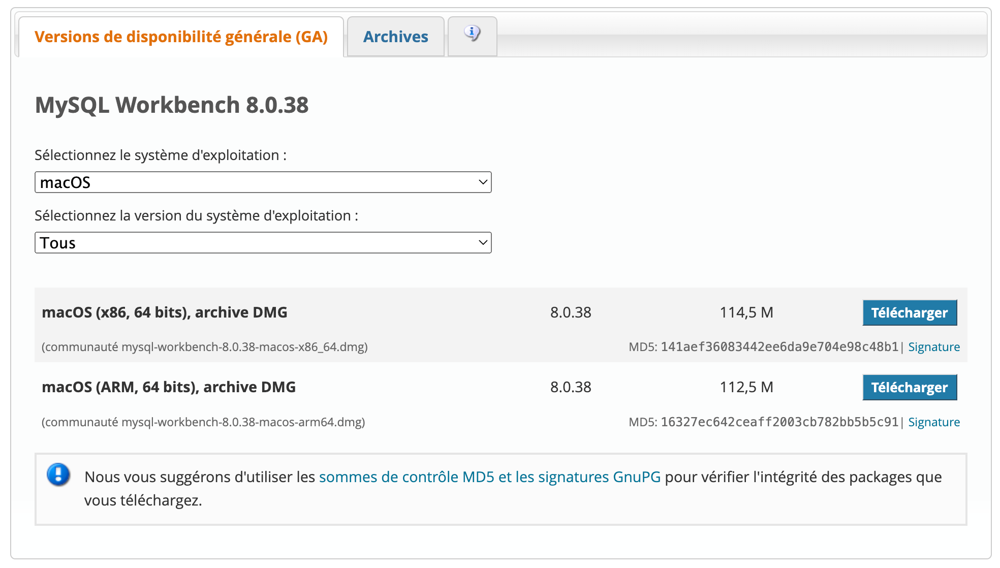

### Installation de PHP sur macOS

### 1. Utilisation de MAMP



- **MAMP** (Macintosh, Apache, MySQL, PHP) est une solution tout-en-un qui simplifie l'installation de PHP, MySQL, et Apache sur macOS. Voici les étapes à suivre :

  1. Téléchargez [MAMP](https://www.mamp.info/en/downloads/) depuis le site officiel.

  2. Installez MAMP en suivant les instructions fournies par l'installateur.

  3. Une fois l'installation terminée, ouvrez MAMP et démarrez les serveurs Apache et MySQL via l'interface de MAMP.

  - MAMP est particulièrement utile pour ceux qui souhaitent configurer rapidement un environnement de développement local sans avoir à gérer manuellement chaque composant.

### 2. Installation via Homebrew

- **Homebrew** est un gestionnaire de packages pour macOS qui permet d'installer PHP et d'autres outils de manière simple et efficace. Voici comment installer PHP en utilisant Homebrew :

  1. Ouvrez le Terminal.
  2. Exécutez la commande suivante pour installer PHP :

```bash
brew install php
```

- Cela installera PHP sur votre machine. Vous pouvez ensuite configurer Apache ou Nginx pour utiliser PHP en modifiant les fichiers de configuration appropriés (comme `httpd.conf` pour Apache).

- Homebrew est une excellente option pour les utilisateurs qui préfèrent un contrôle granulaire sur les versions et les configurations des logiciels installés.

- Vous pouvez installer MySQL via un package DMG téléchargé depuis le site officiel de MySQL ou utiliser Homebrew avec la commande suivante :

### 3. Installation et configuration de MySQL

[](https://dev.mysql.com/downloads/workbench/)

- Vous pouvez installer MySQL sur macOS de deux façons principales :

#### 3.1 Installation via package DMG

1. Téléchargez le package DMG de MySQL depuis le [site officiel de MySQL](https://dev.mysql.com/downloads/mysql/).
2. Installez MySQL en suivant les instructions de l'installateur.
3. Après l'installation, démarrez MySQL depuis les Préférences Système ou via le terminal.

#### 3.2 Installation via Homebrew

1. Ouvrez le Terminal.
2. Exécutez la commande suivante pour installer MySQL :

```bash
brew install mysql
```

- Après l'installation, démarrez MySQL avec la commande :

```bash
  brew services start mysql
```

##### 4. Configuration de MySQL

- Une fois MySQL installé, vous pouvez configurer votre base de données en suivant ces étapes :

  1. Connectez-vous à MySQL en utilisant la commande suivante :

```bash
mysql -u root -p
```

- Saisissez le mot de passe `root` que vous avez défini lors de l'installation.
- Créez un nouvel utilisateur MySQL avec les privilèges appropriés :

```bash
CREATE USER 'username'@'localhost' IDENTIFIED BY 'password';
```

- Remplacez `'username'` par le nom d'utilisateur souhaité et `'password'` par le mot de passe correspondant.

```bash
GRANT ALL PRIVILEGES ON database_name.* TO 'username'@'localhost';
```

- Remplacez `'database_name'` par le nom de la base de données spécifique et `'username'` par le nom d'utilisateur auquel vous souhaitez accorder les privilèges.
- Après avoir configuré les utilisateurs et les privilèges, vous pouvez commencer à utiliser MySQL pour stocker et gérer les données de votre application web.
- Pour plus d'informations sur la configuration et l'utilisation de MySQL, consultez la [documentation officielle de MySQL](https://dev.mysql.com/doc/).

4. Ressources supplémentaires :

- [Site officiel de MAMP](https://www.mamp.info/en/downloads/)
- [Site officiel de Homebrew](https://brew.sh/)

**Remarque** : _Installer mamp selon l’architecture de votre système_

