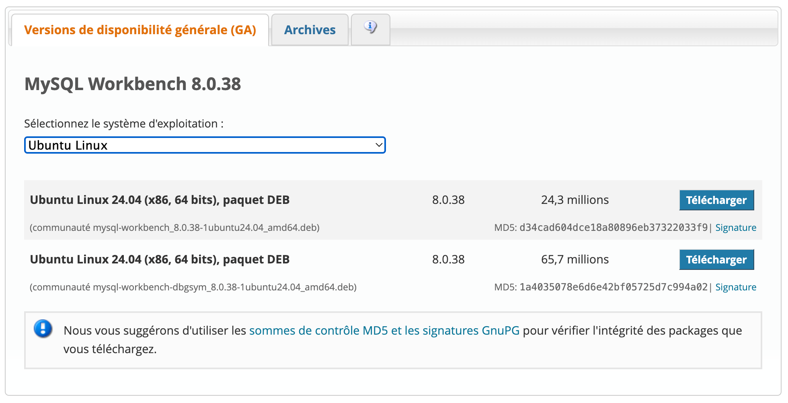

## Installation et configuration de MySQL sur Linux (Ubuntu/Debian)

[](https://dev.mysql.com/downloads/workbench/)

MySQL est un système de gestion de bases de données relationnelles open source, largement utilisé avec PHP pour développer des applications web dynamiques. Ce tutoriel vous guidera à travers les étapes d'installation et de configuration de MySQL sur un système Linux basé sur Debian, tel qu'Ubuntu.

### 1. Installation de MySQL

#### 1.1 Installation via le gestionnaire de packages

La méthode la plus simple pour installer MySQL sur Ubuntu/Debian est d'utiliser le gestionnaire de packages `apt`.

1. Mettez à jour la liste des packages disponibles :

```bash
sudo apt update
```

2. Installez le serveur MySQL en utilisant la commande suivante :

```bash
sudo apt install mysql-server
```

- Pendant l'installation, vous serez invité à définir un mot de passe pour l'utilisateur `root` de MySQL.

#### 1.2 Installation via le dépôt MySQL

Une autre méthode consiste à installer MySQL directement depuis le dépôt officiel de MySQL, ce qui permet d'obtenir la dernière version disponible.

1. Téléchargez et ajoutez le dépôt MySQL à votre système :

```bash
wget https://dev.mysql.com/get/mysql-apt-config_0.8.17-1_all.deb
sudo dpkg -i mysql-apt-config_0.8.17-1_all.deb
```

- Sélectionnez la version de MySQL que vous souhaitez installer (MySQL 8.0, MySQL 5.7, etc.) et terminez l'installation du dépôt.

2. Mettez à jour la liste des packages et installez MySQL :

```bash
sudo apt update && apt install mysql-server
```

- Lors de l'installation, vous serez invité à sélectionner la version de MySQL que vous souhaitez installer et à définir un mot de passe pour l'utilisateur `root`.

### 2. Configuration de MySQL

#### 2.1 Connexion à MySQL

Après l'installation, vous pouvez vous connecter à MySQL en tant qu'utilisateur `root` pour commencer la configuration.

1. Utilisez la commande suivante pour vous connecter :

```bash
sudo mysql -u root -p
```

1. Saisissez le mot de passe `root` que vous avez défini lors de l'installation.

#### 2.2 Configuration des utilisateurs et des privilèges

Une fois connecté à MySQL, vous pouvez configurer des utilisateurs et attribuer des privilèges.

1. Créez un nouvel utilisateur :

```sql
CREATE USER 'username'@'localhost' IDENTIFIED BY 'password';
```

- Remplacez `'username'` par le nom d'utilisateur souhaité et `'password'` par le mot de passe correspondant.

2. Accordez des privilèges à cet utilisateur :

```sql
GRANT ALL PRIVILEGES ON *.* TO 'username'@'localhost';
```

- Remplacez `'database_name'` par le nom de la base de données spécifique et `'username'` par le nom d'utilisateur auquel vous souhaitez accorder les privilèges.
- Cette commande accorde à l'utilisateur tous les privilèges sur toutes les bases de données. Vous pouvez ajuster les privilèges en fonction de vos besoins.

### Démarrage et arrêt du serveur MySQL

Vous pouvez démarrer et arrêter le serveur MySQL en utilisant les commandes suivantes :

- Pour démarrer MySQL :

```bash
sudo systemctl start mysql
```

- Pour arrêter MySQL :

```bash
sudo systemctl stop mysql
```

### 4. Sécurisation de MySQL

Il est recommandé de sécuriser votre installation MySQL en exécutant le script `mysql_secure_installation`.

1. Exécutez le script de sécurisation :

```bash
sudo mysql_secure_installation
```

1. Suivez les instructions pour configurer des options de sécurité telles que la suppression des utilisateurs anonymes, la désactivation de la connexion root à distance, et la suppression des bases de données de test.

### 5. Ressources supplémentaires

Pour une utilisation plus approfondie et une configuration avancée de MySQL, vous pouvez consulter la [documentation officielle de MySQL](https://dev.mysql.com/doc/).

### 6. Conclusion

L'installation et la configuration de MySQL sur Ubuntu/Debian sont des étapes importantes pour tout développeur souhaitant créer des applications web dynamiques. En suivant ce tutoriel, vous avez mis en place un environnement de base pour gérer vos bases de données et les sécuriser.