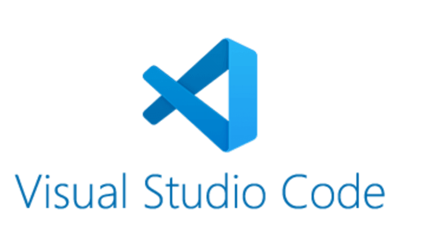
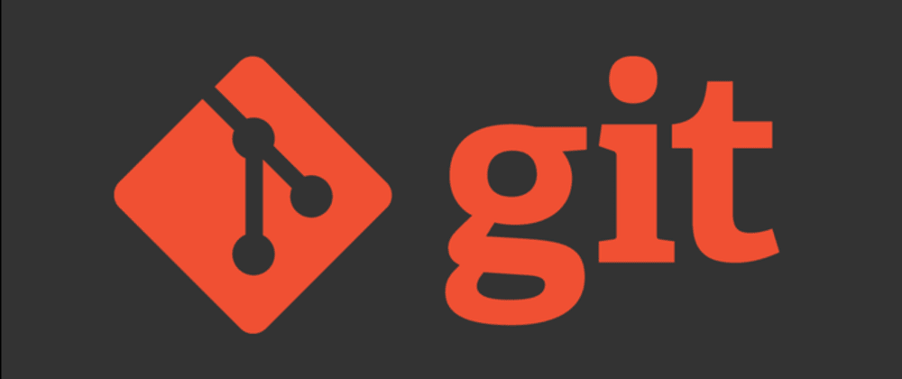

### Outils de développement recommandés

Le choix des outils de développement est crucial pour maximiser l'efficacité, la productivité et la qualité du code produit. Dans cette section, nous allons explorer quelques-uns des outils les plus recommandés pour les développeurs, en mettant l'accent sur les environnements de développement intégrés (IDE) et la gestion des versions avec Git.

#### Environnements de développement intégrés (IDE)

Les environnements de développement intégrés (IDE) sont des applications qui fournissent des fonctionnalités complètes pour le développement de logiciels, en regroupant des outils comme un éditeur de code, un débogueur, un gestionnaire de fichiers, et souvent, une intégration avec des systèmes de gestion de versions. Voici quelques IDE populaires et recommandés :

- **Visual Studio Code (VS Code) :**

  - **Description :** VS Code est un éditeur de code source gratuit et open-source développé par Microsoft. Il est léger, flexible et possède une large communauté qui contribue à des extensions et des plug-ins, rendant cet éditeur extrêmement personnalisable.
  - **Fonctionnalités clés :** Autocomplétion intelligente, débogage intégré, support de Git, terminal intégré, extensions pour des langages spécifiques (comme Python, JavaScript, etc.), et intégration avec des services cloud comme Azure.
  - **Avantages :** Gratuité, communauté active, extensibilité, support pour une grande variété de langages de programmation.
  - **Inconvénients :** Pour les projets très lourds, VS Code peut nécessiter une configuration supplémentaire ou des extensions spécifiques.

- **PhpStorm :**

  - **Description :** PhpStorm, développé par JetBrains, est un IDE payant spécialement conçu pour les développeurs PHP. Il fournit des outils puissants et spécifiques pour le développement web, en particulier avec PHP.
  - **Fonctionnalités clés :** Support complet de PHP, HTML, CSS, JavaScript, intégration avec des bases de données, outils de refactoring, support des frameworks (comme Laravel, Symfony), et un débogueur PHP intégré.
  - **Avantages :** Outils robustes pour le développement PHP, intégration fluide avec les bases de données et systèmes de gestion de versions, support technique de qualité.
  - **Inconvénients :** Coût, consommation de ressources plus élevée que les éditeurs de texte légers.

- **Sublime Text :**

  - **Description :** Sublime Text est un éditeur de texte multiplateforme, reconnu pour sa vitesse et sa simplicité. Bien qu'il ne soit pas un IDE complet, il est souvent utilisé par les développeurs pour son efficacité et sa capacité à gérer des projets complexes grâce à ses fonctionnalités d'édition avancées.
  - **Fonctionnalités clés :** Édition multi-sélection, interface minimaliste, vitesse d'exécution, et une grande variété de plug-ins disponibles via le package manager.
  - **Avantages :** Rapidité, légèreté, personnalisation via les plug-ins, interface utilisateur simple.
  - **Inconvénients :** Pas d'intégration native de fonctionnalités avancées comme le débogage ou la gestion de versions (besoin de plug-ins).

#### Gestion des versions avec Git

La gestion des versions est une pratique essentielle pour tout développeur, permettant de suivre les modifications du code, collaborer avec d'autres développeurs, et gérer les différentes versions d'un projet. Git est l'un des systèmes de gestion de versions les plus populaires et utilisés dans l'industrie.

- **Introduction à Git :**

  - **Qu'est-ce que Git ?** Git est un système de contrôle de versions décentralisé, qui permet aux développeurs de suivre les modifications dans le code source au fil du temps. Il permet également de travailler simultanément sur différentes branches du code, facilitant ainsi le développement collaboratif.
  - **Pourquoi utiliser Git ?** Git aide à maintenir un historique complet des modifications, facilite la collaboration entre développeurs, permet de revenir à des versions antérieures du code, et est essentiel pour les workflows de développement modernes.

- **Installation de Git :**

  - **Étapes d'installation :** Git peut être installé sur différents systèmes d'exploitation, notamment Windows, macOS, et Linux. Pour l'installer, il suffit de télécharger l'installateur à partir du site officiel ([git-scm.com](http://git-scm.com)) et de suivre les instructions spécifiques à votre système d'exploitation.
  - **Configuration initiale :** Une fois Git installé, il est important de le configurer avec votre nom d'utilisateur et votre adresse email en utilisant les commandes `git config --global user.name "Votre Nom"` et `git config --global user.email "votre.email@example.com"`. Ces informations seront utilisées dans les commits pour identifier l'auteur des changements.

- **Utilisation basique de Git :**

  - **Création d'un dépôt Git :** Pour commencer à utiliser Git dans un projet, il faut initialiser un nouveau dépôt avec la commande `git init`. Cela crée un dossier `.git` dans le répertoire du projet qui contiendra toutes les informations de suivi de versions.
  - **Les commandes essentielles :**
    - `git add` : Cette commande permet de sélectionner les fichiers que vous souhaitez inclure dans votre prochain commit.
    - `git commit` : Utilisée pour sauvegarder les modifications dans l'historique du dépôt. Par exemple, `git commit -m "Message du commit"` enregistre les modifications avec un message descriptif.
    - `git status` : Affiche l'état des fichiers dans le dépôt, indiquant lesquels ont été modifiés ou ajoutés.
    - `git log` : Affiche l'historique des commits, permettant de visualiser les changements effectués au fil du temps.
    - `git branch` et `git checkout` : Utilisées pour gérer et changer de branches, facilitant le développement de nouvelles fonctionnalités ou corrections de bugs en parallèle du développement principal.
    - `git merge` : Combine les changements d'une branche dans une autre, facilitant l'intégration de nouvelles fonctionnalités ou corrections de bugs dans le projet principal.

La maîtrise des IDE et des outils de gestion de versions comme Git est essentielle pour tout développeur souhaitant améliorer son efficacité, sa collaboration avec d'autres développeurs, et la qualité de ses projets. En investissant du temps dans l'apprentissage de ces outils, vous serez mieux équipé pour relever les défis du développement logiciel moderne.

Ressources supplémentaires :

- [Visual Studio Code](https://code.visualstudio.com/)
- [PhpStorm](https://www.jetbrains.com/phpstorm/)
- [Sublime Text](https://www.sublimetext.com/)
- [Git - Site officiel](http://git-scm.com)
- [GitHub - Plateforme de développement collaboratif basée sur Git](https://github.com)